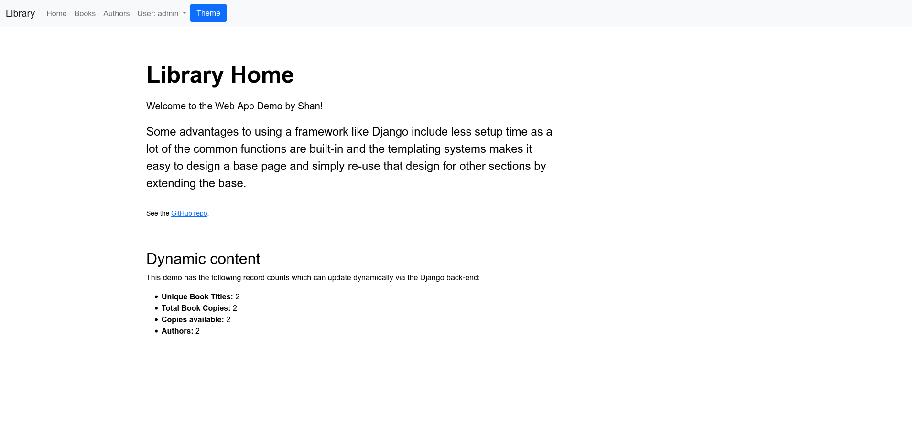
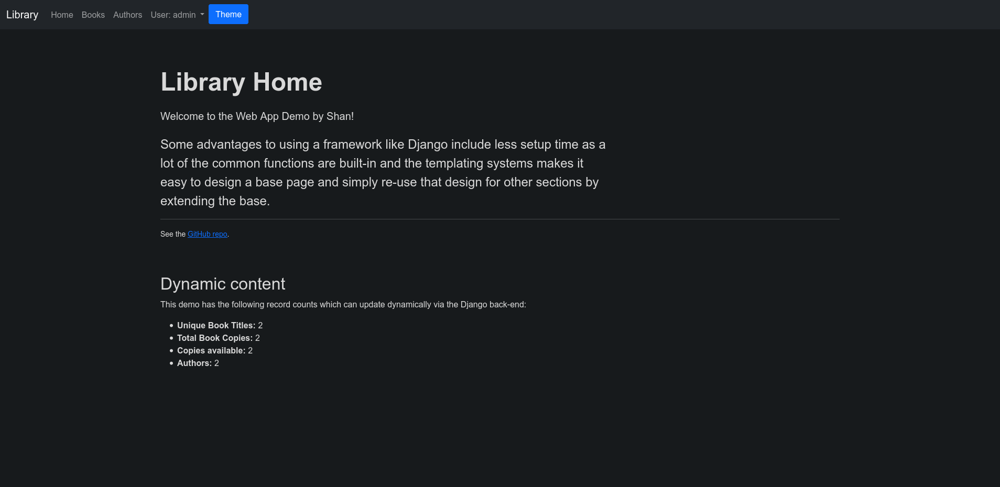
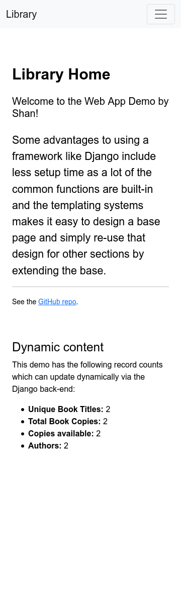
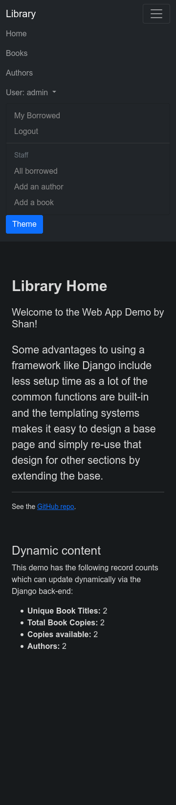
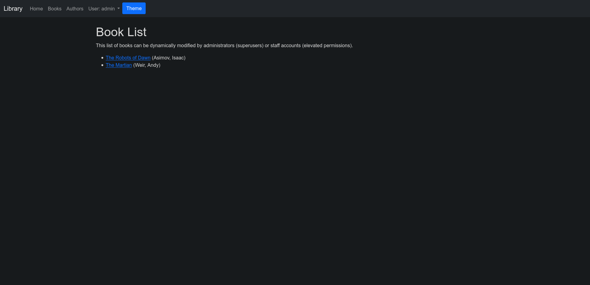
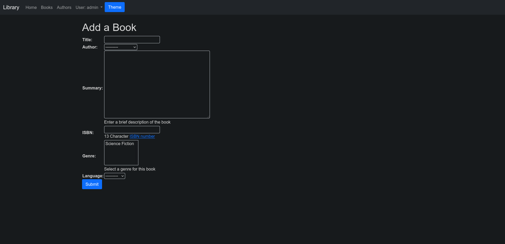
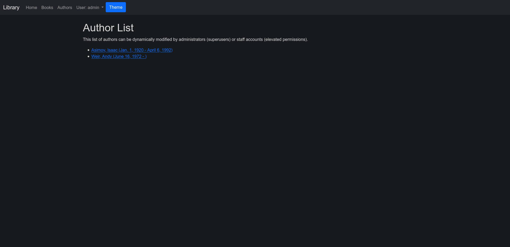

# Django Book Catalog

### A demo website written in Python's Django framework

This project is based on the essentials learned from the Mozilla Developer Network (MDN) tutorials which can be found [here](https://developer.mozilla.org/en-US/docs/Learn/Server-side/Django/Tutorial_local_library_website).

Originally created as a learning project in October 2018, this has been updated occasionally to the most recent versions of the technology stack and also to expand on the skills and technologies learned over the years.

Most recently (July 2021):

- Overhauled to Django 3.
- Converted to Bootstrap 5.
- Custom auto-detecting (`prefers-color-scheme: dark`) dark theme using CSS variables and a simple vanilla JavaScript toggle.
- Perpared for Docker with PostgreSQL.

## Getting Started with Development

This project uses Python, Django and a PostgreSQL database (SQLite in development).

### Prerequisites

Use a Python virtual environment for local development.

```bash
python3 -m venv env
```

### Installing

Activate the Python virtual environemnt and then install with:

```bash
pip install -r requirements.txt
```

To run with Docker:

```bash
docker-compose up
```

To end the session with Docker (with optional volume flag):

```bash
docker-compose down
...
docker-compose down -v
```

For development the Django defaults apply, see the official [Django documentation](https://docs.djangoproject.com/en/2.2/) for more details.

Quick reference:

```bash
python manage.py startapp appname
python manage.py createsuperuser
python manage.py makemigrations
python manage.py migrate
python manage.py runserver
```

The following environment variables need to be set so that they can be accessed in `settings.py`:

## Environment Variables

- `DEVELOPMENT_MODE` is a boolean to enable development options. Defaults to False.
- `APP_SECRET_KEY` is the encryption key used by Django, specifc to development. It is recommended to use a different key in production.
- `DATABASE_URL` is the url for a database connection. _This may vary based on deployment platform (Heroku, DigitalOcean, etc.)._

## Tests

Test are performed with Python's built in testing library.

```
python manage.py test
```

## Deployment

Use a Docker capable deployment process for best results.
Always verify if any environment variables will need to be modified to suit the deployment platform.

## Usage

Here are some screenshots of the application.

The main page:




The main page in mobile view:


<br />


The book list:




The author list:



## Built With

- [Django](https://www.djangoproject.com/) - a high-level Python Web framework that encourages rapid development and clean, pragmatic design

- [Bootstrap (front-end library)](https://getbootstrap.com/) - Bootstrap is an open source toolkit for developing with HTML, CSS, and JS.

## License

This project is licensed under the MIT License - see the [LICENSE.md](LICENSE.md) file for details
